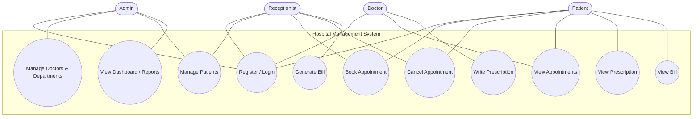

# Use-Case Diagram & Descriptions
## Hospital Management System

> Diagrams are written in **Mermaid**. They render automatically on GitHub and in many
> Markdown viewers (VS Code with the Mermaid extension). You can also paste them into
> https://mermaid.live to export PNG/SVG for your report.

---

## 1. Use-Case Diagram

---

## 2. Use-Case Descriptions

### UC-4: Book Appointment
| Field | Detail |
|-------|--------|
| **Actors** | Patient, Receptionist |
| **Precondition** | User is logged in; at least one doctor exists. |
| **Main Flow** | 1. User selects a department and doctor. 2. User picks a date and time slot. 3. System checks slot availability (FR-14). 4. System creates the appointment with status `booked`. 5. System shows confirmation. |
| **Alternate Flow** | 3a. Slot already taken → system shows "slot unavailable" and asks for another time. |
| **Postcondition** | A new appointment record is stored. |
| **Related FRs** | FR-13, FR-14 |

### UC-7: Write Prescription
| Field | Detail |
|-------|--------|
| **Actors** | Doctor |
| **Precondition** | Doctor is logged in and has a completed/ongoing appointment. |
| **Main Flow** | 1. Doctor opens an appointment. 2. Doctor enters diagnosis, medicines, and notes. 3. System saves the prescription linked to the appointment and patient. |
| **Postcondition** | Prescription is viewable by the patient. |
| **Related FRs** | FR-18, FR-19 |

### UC-9: Generate Bill
| Field | Detail |
|-------|--------|
| **Actors** | Receptionist |
| **Precondition** | An appointment exists. |
| **Main Flow** | 1. Receptionist selects an appointment. 2. Adds itemized charges. 3. System computes total. 4. System saves the bill with status `unpaid`. |
| **Alternate Flow** | Mark bill as `paid` after payment. |
| **Postcondition** | Bill is viewable by the patient. |
| **Related FRs** | FR-21, FR-22 |

### UC-3: Manage Doctors & Departments
| Field | Detail |
|-------|--------|
| **Actors** | Admin |
| **Precondition** | Admin is logged in. |
| **Main Flow** | 1. Admin adds/edits/removes a doctor. 2. Assigns department + specialization. 3. System persists changes. |
| **Postcondition** | Doctor list reflects changes. |
| **Related FRs** | FR-10, FR-11, FR-12 |
