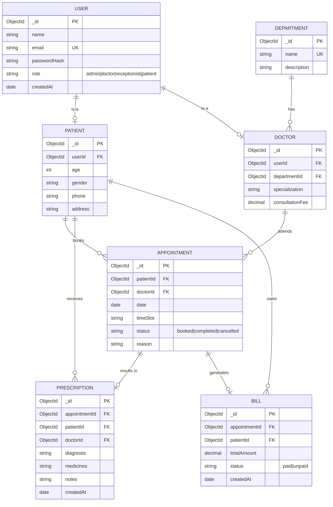

# ER Diagram & Data Dictionary
## Hospital Management System

> Mermaid `erDiagram`. Paste into https://mermaid.live to export an image for your report.

---

## 1. Entity-Relationship Diagram

---

## 2. Data Dictionary

### USER
| Field | Type | Constraints | Description |
|-------|------|-------------|-------------|
| _id | ObjectId | PK | Unique identifier |
| name | String | required | Full name |
| email | String | required, unique | Login email |
| passwordHash | String | required | bcrypt hash |
| role | Enum | required | admin / doctor / receptionist / patient |
| createdAt | Date | auto | Record creation time |

### PATIENT
| Field | Type | Constraints | Description |
|-------|------|-------------|-------------|
| userId | ObjectId | FK → USER | Linked account |
| age | Number | ≥ 0 | Patient age |
| gender | Enum | male/female/other | Gender |
| phone | String | required | Contact number |
| address | String | optional | Address |

### DOCTOR
| Field | Type | Constraints | Description |
|-------|------|-------------|-------------|
| userId | ObjectId | FK → USER | Linked account |
| departmentId | ObjectId | FK → DEPARTMENT | Department |
| specialization | String | required | e.g. Cardiologist |
| consultationFee | Number | ≥ 0 | Fee per visit |

### APPOINTMENT
| Field | Type | Constraints | Description |
|-------|------|-------------|-------------|
| patientId | ObjectId | FK → PATIENT | Who booked |
| doctorId | ObjectId | FK → DOCTOR | Assigned doctor |
| date | Date | required | Appointment date |
| timeSlot | String | required | e.g. "10:00-10:30" |
| status | Enum | default booked | booked/completed/cancelled |
| reason | String | optional | Reason for visit |

> **Unique index:** (doctorId, date, timeSlot) enforces FR-14 (no double-booking).

### PRESCRIPTION
| Field | Type | Constraints | Description |
|-------|------|-------------|-------------|
| appointmentId | ObjectId | FK → APPOINTMENT | Source appointment |
| patientId | ObjectId | FK → PATIENT | Patient |
| doctorId | ObjectId | FK → DOCTOR | Issuing doctor |
| diagnosis | String | required | Diagnosis |
| medicines | String | required | Prescribed medicines |
| notes | String | optional | Extra notes |

### BILL
| Field | Type | Constraints | Description |
|-------|------|-------------|-------------|
| appointmentId | ObjectId | FK → APPOINTMENT | Source appointment |
| patientId | ObjectId | FK → PATIENT | Billed patient |
| totalAmount | Number | ≥ 0 | Total payable |
| status | Enum | default unpaid | paid/unpaid |
