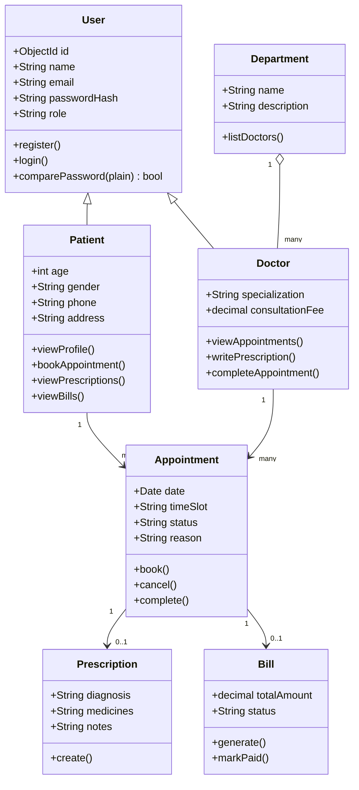
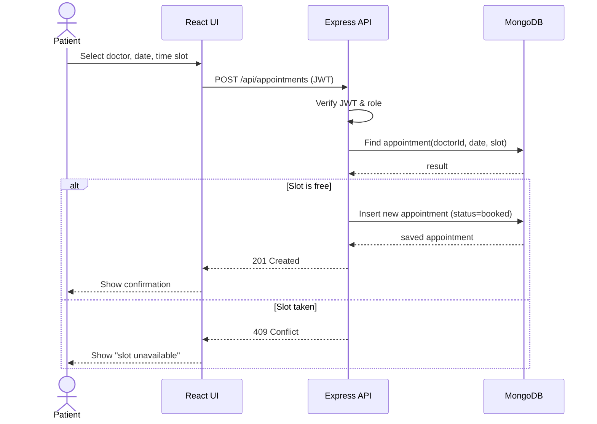
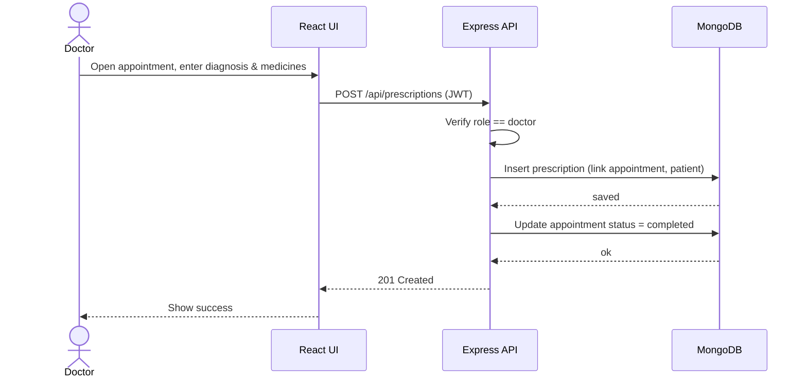
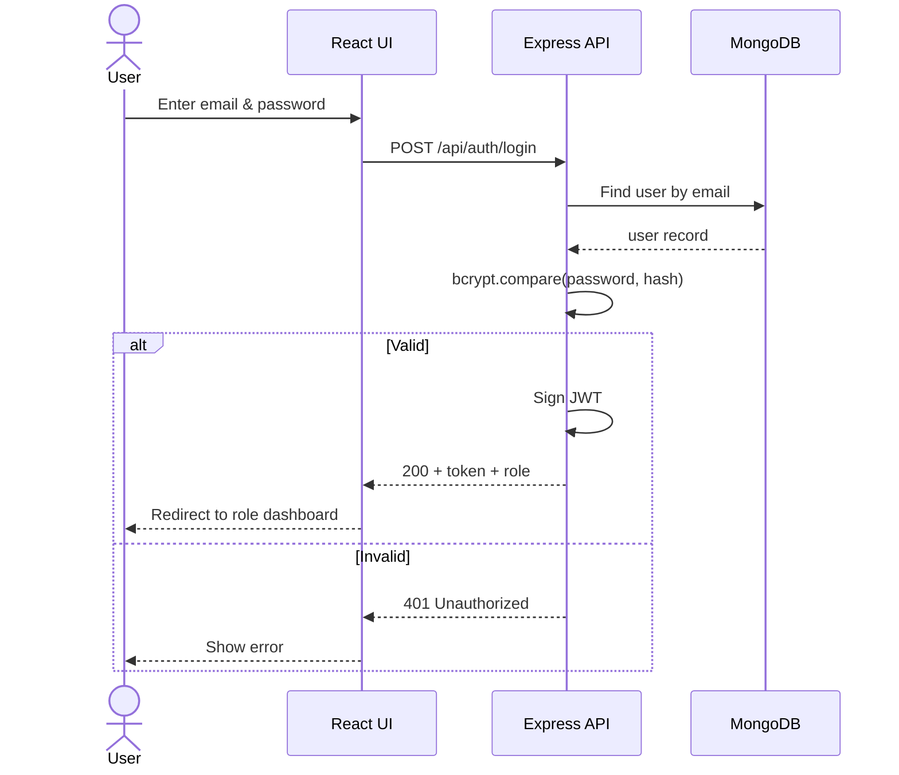

# Class & Sequence Diagrams
## Hospital Management System

> Mermaid diagrams. Export via https://mermaid.live for your report.

---

## 1. Class Diagram

---

## 2. Sequence Diagram — Book Appointment (UC-4)

---

## 3. Sequence Diagram — Write Prescription (UC-7)

---

## 4. Sequence Diagram — Login (UC-1)

